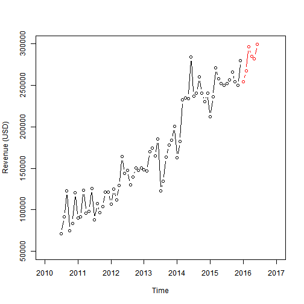

Revenue Forecaster
========================================================
author: Ramshanker Krishnan 
date: 23rd January 2016


Forecasting, planning and goals
========================================================
- Forecasting is about predicting the future as accurately as possible, given all the information available including historical data and knowledge of any future events that might impact the forecasts.
- Goals are what you would like to happen. Goals should be linked to forecasts and plans, but this does not always occur. Too often, goals are set without any plan for how to achieve them, and no forecasts for whether they are realistic. Planning is a response to forecasts and goals.
-  Planning involves determining the appropriate actions that are required to make your forecasts match your goals. 

Buiness & Forecasting
========================================================
Forecasting should be an integral part of the decision-making activities of management, as it can play an important role in many areas of a company. Modern organizations require short-, medium- and long-term forecasts, depending on the specific application. 


Holt-Winters approach 
========================================================
- Many companies use the Holt-Winters (HW) method to produce short-term demand forecasts when their sales data contain a trend and a seasonal pattern. 
- The method is popular because it is simple, has low data-storage requirements, and is easily automated
- It also has the advantage of being able to adapt to changes in trends and seasonal patterns in sales when they occur
 
Building a HW prediction model

```r
gddh<-read.csv("DHActuals.csv")
dh <- ts(gddh$DH,start = c(2010, 7), frequency = 12)
dh.hw <- HoltWinters(dh)
```

Short Term Forecast using the HW model
========================================================


